# 🍽️ MenuFlow — Multi-Tenant Restaurant Ordering SaaS

MenuFlow is a multi-tenant restaurant ordering platform that allows restaurants to manage digital menus, receive customer orders, configure delivery options, and manage dine-in QR ordering through a dedicated admin dashboard.

Each restaurant has its own menu, branding, settings, products, tables, delivery areas, and orders.

## 🚀 Live Demo

### 🍽️ Customer Demo

**[Open Restaurant Menu](https://menuflow-psi.vercel.app/crespo-res)**

Explore the restaurant menu, browse products, add items to the cart, and test the customer ordering flow.

### 🔐 Admin Dashboard

**[Open Admin Login](https://menuflow-psi.vercel.app/)**

Access the restaurant administration interface from the main application entry point.


## 📸 Screenshots

### Customer Experience

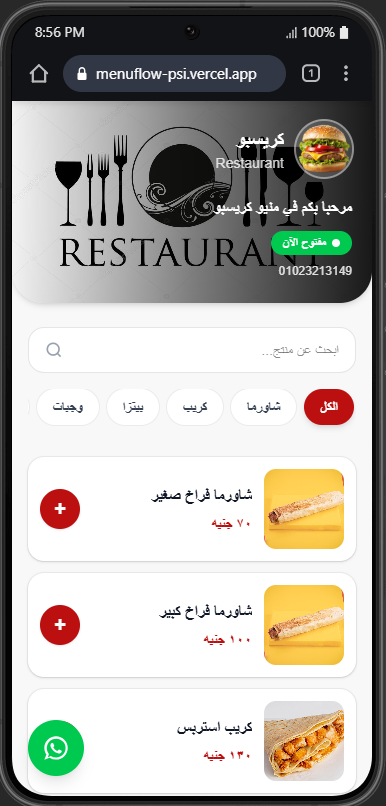

### Ordering

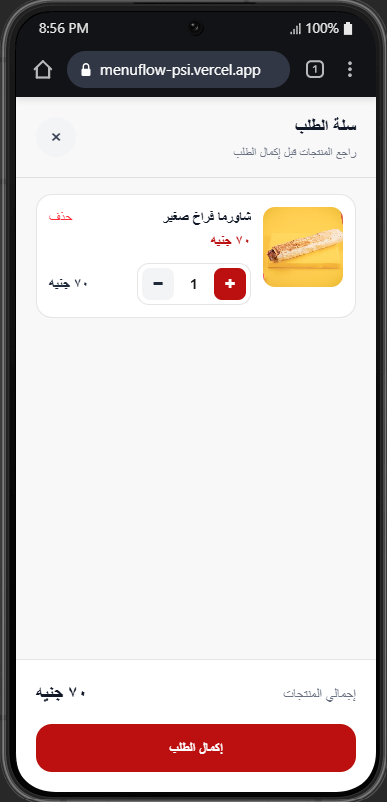

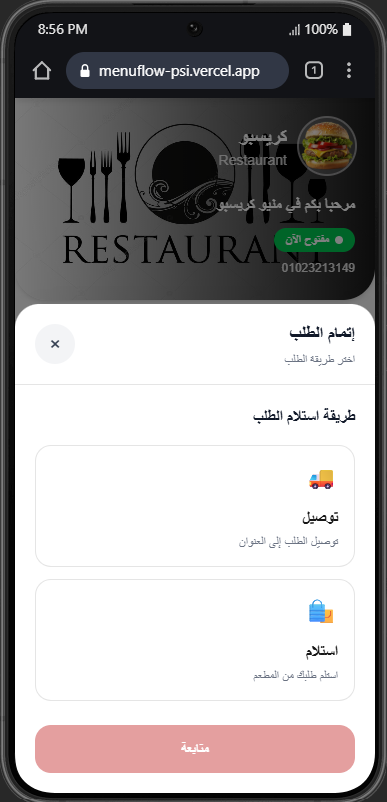

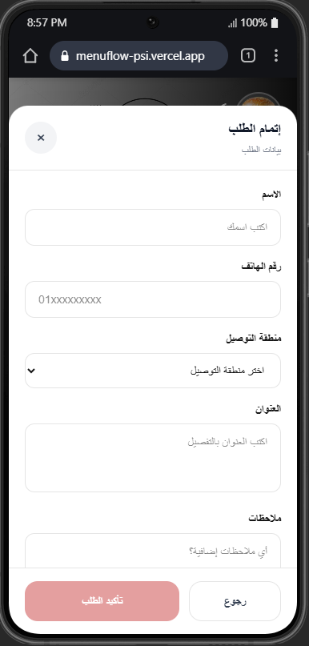

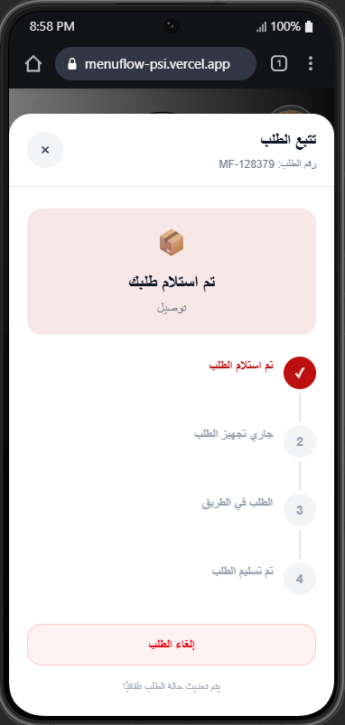

### Restaurant Management

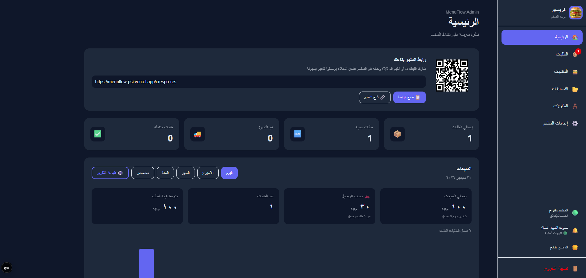

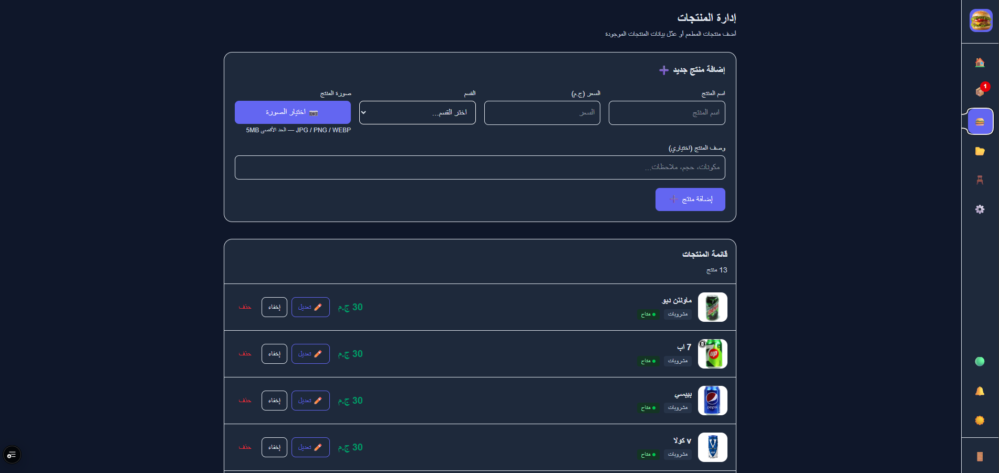

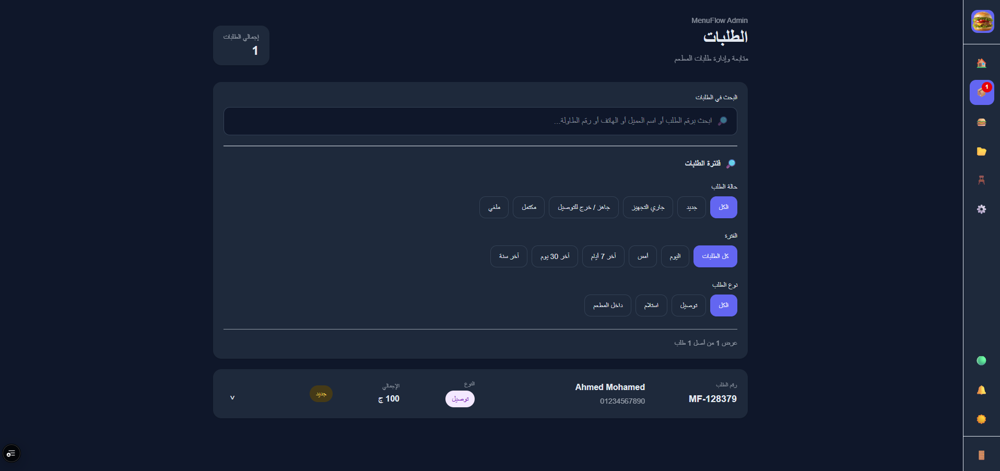

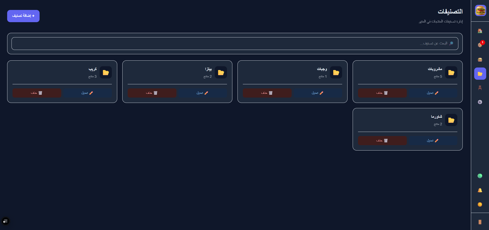

### QR & Restaurant Configuration

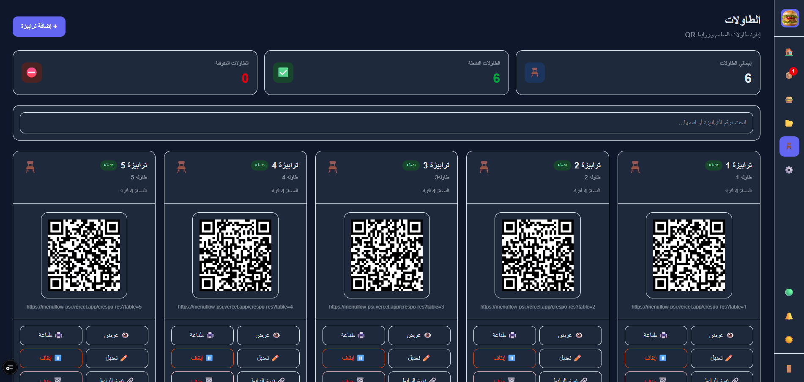

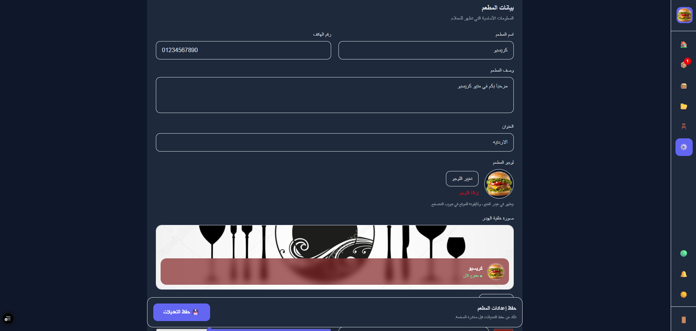

## ✨ Features

### 🍽️ Restaurant Menu

* Restaurant-specific digital menus
* Categories and products
* Product images
* Product availability
* Custom restaurant branding
* Restaurant open/closed status
* Custom restaurant URLs

### 🛒 Customer Ordering

Customers can place orders through:

* Delivery
* Pickup
* Dine-in

The ordering flow includes:

* Product selection
* Cart management
* Customer information
* Delivery area selection
* Order creation
* Order tracking
* WhatsApp order completion where configured

### 🪑 Dine-In QR Ordering

Restaurants can create tables and generate table-specific QR links.

```text id="r4nd2w"
Restaurant
    │
    ├── Table 1 → QR
    ├── Table 2 → QR
    ├── Table 3 → QR
    └── Table 4 → QR
             │
             ▼
       Customer scans QR
             │
             ▼
       Restaurant Menu
             │
             ▼
          Order
             │
             ▼
       Admin Dashboard
```

Orders created from a table can be associated with the corresponding table number.

## 🧑‍💼 Restaurant Admin Dashboard

Restaurant administrators can manage:

* Products
* Categories
* Orders
* Tables
* QR ordering
* Delivery areas
* Restaurant settings
* Branding
* Restaurant status

## 👑 Role-Based Access

MenuFlow supports different administrative roles.

### Restaurant Admin

Can manage the restaurant's own:

* Products
* Categories
* Orders
* Tables
* Delivery areas
* Settings

### Super Admin

Can manage the platform-level administration and restaurant accounts.

## 🏢 Multi-Tenant Architecture

MenuFlow is designed as a multi-tenant application.

Each restaurant has isolated business data such as:

* Products
* Categories
* Orders
* Tables
* Delivery areas
* Settings

A simplified representation:

```text id="x0m5cn"
                    MenuFlow
                       │
          ┌────────────┴────────────┐
          │                         │
     Restaurant A              Restaurant B
          │                         │
     Products                   Products
     Orders                     Orders
     Tables                     Tables
     Settings                   Settings
          │                         │
          └────────────┬────────────┘
                       │
                  PostgreSQL
                       │
                      RLS
```

Restaurant-specific data is associated with a `restaurant_id`, while Row Level Security policies help prevent unauthorized access between tenants.

## 🔐 Security

The application uses Supabase Authentication and PostgreSQL Row Level Security.

Security considerations include:

* Authenticated admin access
* Role-based authorization
* Restaurant-level data isolation
* Protected administrative operations
* Storage access policies
* Row Level Security policies for business data

## 🧰 Tech Stack

### Frontend

* React
* JavaScript
* Vite
* Tailwind CSS
* React Router

### Backend & Database

* Supabase
* PostgreSQL
* Supabase Authentication
* Supabase Storage
* Row Level Security
* PostgreSQL policies

### Development & Deployment

* Git
* GitHub
* Vercel
* VS Code

## ⚙️ Getting Started

### 1. Clone the repository

```bash id="0t6l4d"
git clone https://github.com/Ahmed-M00hamed/restaurant-multi-tenant.git

cd restaurant-multi-tenant
```

### 2. Install dependencies

```bash id="o4o5v9"
npm install
```

### 3. Configure environment variables

Create a `.env.local` file containing your Supabase configuration:

```env id="9y2g4n"
VITE_SUPABASE_URL=your_supabase_url
VITE_SUPABASE_ANON_KEY=your_supabase_anon_key
```

Never commit private credentials or Supabase service-role keys.

### 4. Start the development server

```bash id="v8qg9m"
npm run dev
```

The application will be available at:

```text id="m0s2yv"
http://localhost:5173
```

## 🎯 What I Built

This project was built as a real-world business application rather than a static restaurant website.

It demonstrates experience with:

* Multi-tenant application architecture
* React application development
* Authentication and authorization
* PostgreSQL database design
* Row Level Security
* Restaurant management workflows
* E-commerce-style ordering flows
* Admin dashboards
* QR-based table ordering
* Delivery and pickup workflows
* Responsive UI development
* Production deployment

## 👨‍💻 Author

**Ahmed Mohamed**

Junior React / Frontend Developer

* GitHub: https://github.com/Ahmed-M00hamed
* Live Demo: https://menuflow-psi.vercel.app/crespo-res
